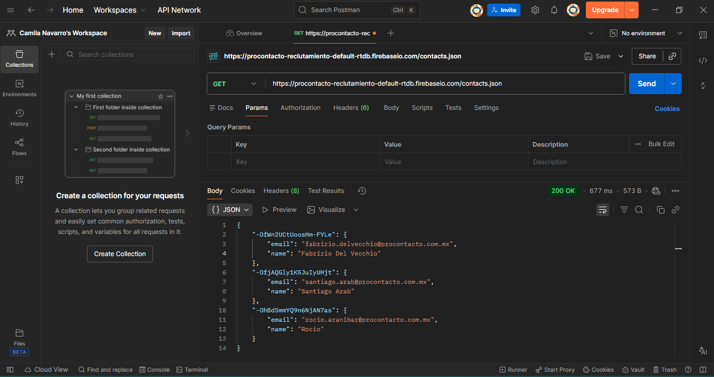
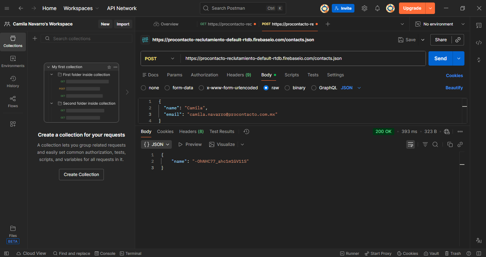
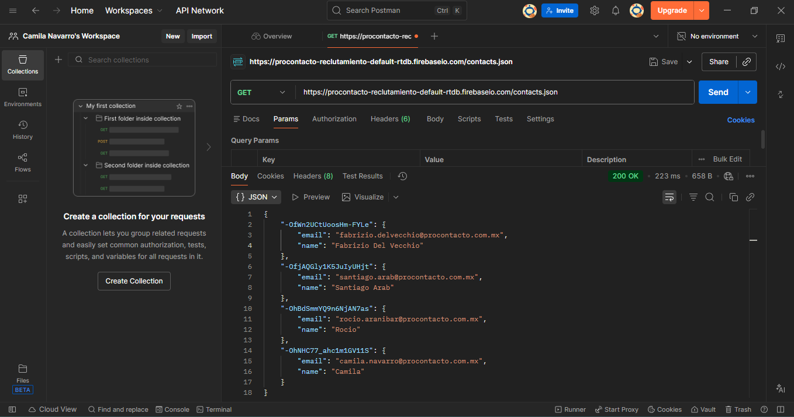

# EVALUACION PRACTICA - Project Management Office (PMO)

## Ejercicio 1: Instalación del ambiente
- Instalación de Visual Studio Code
- Instalación de Git y Git Bash


## Ejercicio 2: Protocolo HTTP
**1. ¿Qué es un servidor HTTP?**<br>
Es un software que recibe solicitudes de clientes (navegadores, apps) y devuelve recursos como HTML, CSS, imágenes o datos.

**2. ¿Qué son los verbos HTTP? Mencionar los más conocidos.**<br>
Son métodos que definen la acción sobre un recurso.<br>
Los más conocidos son:
- GET: obtener datos.
- POST: enviar datos.
- PUT: actualizar un recurso.
- DELETE: eliminar.
- PATCH: modificar parcialmente.
- OPTIONS: consultar capacidades del servidor.

**3. ¿Qué es un request y un response en una comunicación HTTP? ¿Qué son los headers?**<br>
- Request: la petición del cliente (ej. navegador).
- Response: la respuesta del servidor.
- Headers: metadatos que acompañan la comunicación (ej. tipo de contenido, autenticación, idioma).

**4. ¿Qué es un queryString? (En el contexto de una url)**<br>
Es una parte de la URL que contiene parámetros.
- Por ejemplo:    https://ejemplo.com/productos?id=123&color=rojo<br>
Aquí id=123 y color=rojo son parámetros

**5. ¿Qué es el responseCode? ¿Qué significado tiene los posibles valores devueltos?**<br>
Es el código de estado que indica el resultado.<br>
Posibles valores devueltos:
- 200: OK.
- 301/302: redirección.
- 400: error del cliente.
- 401/403: no autorizado/prohibido.
- 404: recurso no encontrado.
- 500: error del servidor.

**6. ¿Cómo se envía la data en un Get y cómo en un POST?**
- GET: datos en la URL como parámetros.
- POST: datos en el cuerpo del mensaje, más seguro para información sensible.

**7. ¿Qué verbo http utiliza el navegador cuando accedemos a una página?**<br>
Al acceder a una página, el navegador usa GET.

**8. Explicar brevemente qué son las estructuras de datos JSON y XML dando ejemplo de estructuras posibles.**
- JSON: formato ligero basado en pares clave-valor.
    Ejemplo: ```{ "nombre": "Camila", "email": "camila@example.com" }```

- XML: formato basado en etiquetas.
    Ejemplo: ```<usuario><nombre>Camila</nombre><email>camila@example.com</email></usuario>```

**9. Explicar brevemente el estándar SOAP.**<br>
Es un estándar de comunicación basado en XML, usa mensajes estructurados y protocolos como HTTP o SMTP. Más rígido y formal, común en sistemas empresariales.

**10. Explicar brevemente el estándar REST Full.**<br>
Es un estándar con una arquitectura ligera que usa HTTP y formatos como JSON. Opera con recursos identificados por URLs y verbos HTTP. Más flexible y ampliamente usado en APIs modernas.

**11. ¿Qué son los headers en un request? ¿Para qué se utiliza el key Content-type en un header?**<br>
Los Headers son metadatos en la petición (ej. autenticación, idioma, tipo de contenido). 
El key Content-Type indica el formato del cuerpo (ej. application/json, text/html), permite al servidor interpretar correctamente los datos enviados.


## Ejercicio 3: Requests con Postman
**1. Realizar un request GET a la URL: https://procontacto-reclutamiento-default-rtdb.firebaseio.com/contacts.json**


**2. Realizar un request POST a la URL anterior, y con body:**


**3. Realizar nuevamente un request GET a la URL:**


**Diferencias observadas entre las llamadas el punto 1 y 3:** 
- Antes (GET P1): Solo los registros existentes.
- Después (GET P3): Incluye el nuevo contacto creado con el POST (aparece bajo un ID único generado por Firebase).


## Ejercicio 4: Trailhead
**URL del Perfil :** https://www.salesforce.com/trailblazer/ku0z1a9j64flo27iuw

### Módulos completados:
  - Fundamento de la plataforma Salesforce
  - Fundamentos de Apex y .NET
  - Modelado de datos
  - Fundamentos y base de datos de Ápex
  - Desencadenadores de Ápex
  - Apex Integration Services


## Ejercicio 5: Objetos de Salesforce
**1. Lead**
- Concepto: Potencial cliente que todavía no fue calificado. Es alguien que mostró interés, pero aún no se sabe si es cliente real.
- Campos estándar: Nombre, Empresa, Email, Teléfono, Estado, Fuente del lead.
- Relación: No se relaciona directamente con Account, Contact u Opportunity. Al convertirse, genera Account, Contact y opcionalmente una Opportunity.

**2. Account**
- Concepto: Empresa o entidad con la que se tiene relación comercial.
- Campos estándar: Nombre de la cuenta, Industria, Dirección, Teléfono, Tipo.
- Relación: Se vincula con Contacts, Opportunities, Cases, Assets. Puede tener Quotes (indirectamente).

**3. Contact**
- Concepto: Persona específica que trabaja o pertenece a un Account.
- Campos estándar: Nombre, Apellido, Email, Teléfono, Cargo, Dirección.
- Relación: Pertenece a un Account. Puede estar relacionado con Opportunities, Cases y Quotes.

**4. Opportunity**
- Concepto: Negocio potencial en curso.
- Campos estándar: Nombre, Etapa, Monto, Fecha de cierre, Cuenta asociada.
- Relación: Se vincula con Account, Contact, Quote, Product (a través de PriceBook).

**5. Product**
- Concepto: Bienes o servicios que la empresa vende.
- Campos estándar: Nombre, Código, Descripción, Estado (activo/inactivo).
- Relación: Se vincula a PriceBook, Opportunities y Quotes. No se relaciona directamente con Account o Contact.

**6. PriceBook**
- Concepto: Lista de precios de productos.
- Campos estándar: Nombre, Estado (activo/inactivo).
- Relación: Contiene muchos Products. Se asigna a Opportunities y Quotes.

**7. Quote**
- Concepto: Propuesta comercial enviada al cliente.
- Campos estándar: Nombre, Estado, Fecha de vencimiento, Total.
- Relación: Pertenece a una Opportunity. Usa un PriceBook. Tiene Products. Relacionada indirectamente con Account y Contact

**8. Asset**
- Concepto: Producto adquirido por un cliente (ya vendido).
- Campos estándar: Nombre, Producto, Número de serie, Estado, Cuenta asociada.
- Relación: Pertenece a un Account. Se origina desde Opportunity y Product.

**9. Case**
- Concepto: Ticket de soporte o atención al cliente.
- Campos estándar: Número de caso, Estado, Prioridad, Descripción, Cuenta, Contacto.
- Relación: Pertenece a un Account. Asociado a Contact y Asset.

**10. Article**
- Concepto: Documento de conocimiento (FAQ, guía, solución).
- Campos estándar: Título, Contenido, Categoría, Estado de publicación.
- Relación: No tiene relaciones directas obligatorias. Se vincula con Cases para resolver incidencias.

### Diagrama UML:


## Ejercicio 6: Conceptos de Salesforce
### Soluciones de Salesforce
**A. ¿Qué es Salesforce?**<br>
Salesforce es el CRM líder mundial, una plataforma en la nube que centraliza la gestión de relaciones con clientes. Permite a las empresas integrar marketing, ventas, servicio y comercio electrónico en un solo sistema.

**B. ¿Qué es Sales Cloud?**<br>
Sales Cloud es la solución de ventas de Salesforce. Ayuda a gestionar clientes potenciales, oportunidades y cerrar acuerdos con mayor eficiencia. Automatiza tareas de ventas y ofrece información en tiempo real para impulsar ingresos.

**C. ¿Qué es Service Cloud?**<br>
Service Cloud es la plataforma de atención al cliente de Salesforce. Permite ofrecer soporte multicanal (teléfono, chat, email, redes sociales) con agentes humanos e inteligencia artificial. Su objetivo es mejorar la experiencia del cliente y reducir costos de servicio.

**D. ¿Qué es Health Cloud?**<br>
Health Cloud es la solución para el sector sanitario. Centraliza datos clínicos y no clínicos de pacientes, facilitando la colaboración entre profesionales de la salud. Mejora la atención personalizada y la coordinación de cuidados.

**E. ¿Qué es Marketing Cloud?**<br>
Marketing Cloud es la plataforma de marketing digital de Salesforce. Permite crear campañas personalizadas, automatizar comunicaciones y analizar resultados en múltiples canales (email, redes sociales, publicidad). Su objetivo es mejorar la experiencia del cliente y aumentar la fidelización.


### Funcionalidades de Salesforce 
**A. ¿Qué es un RecordType?**<br> 
Permite definir variaciones de un mismo objeto (ej. diferentes tipos de cuentas u oportunidades). Se usa para mostrar distintos Page Layouts y procesos de negocio según el tipo de registro.

**B. ¿Qué es un ReportType?**<br>
Es la plantilla base de un informe. Define qué objetos y relaciones estarán disponibles para construir un reporte.

**C. ¿Qué es un Page Layout?**<br>
Es el diseño de la interfaz de usuario para un objeto. Controla qué campos, secciones, botones y listas relacionadas se muestran.

**D. ¿Qué es un Compact Layout?**<br>
Define los campos clave que aparecen en la vista rápida (ej. encabezado de un registro en móvil o Lightning).

**E. ¿Qué es un Perfil?**<br>
Es un conjunto de permisos y configuraciones que determinan qué puede hacer un usuario en Salesforce (objetos, campos, apps).

**F. ¿Qué es un Rol?**<br>
Define la jerarquía de visibilidad de datos. Controla qué registros puede ver un usuario según su posición en la organización.

**G. ¿Qué es un Validation Rule?**<br>
Son reglas que validan datos antes de guardar un registro.

**H. ¿Qué diferencia hay entre una relación Master Detail y Lookup?**<br>
El Master-Detail es una relación fuerte, el registro hijo depende del padre (si se borra el padre, se borra el hijo), encambio el Lookup es una relación más flexible, el hijo puede existir sin el padre.

**I. ¿Qué es un Sandbox?**<br>
Es un entorno de pruebas aislado de producción. Permite desarrollar, probar y entrenar sin afectar los datos reales.

**J. ¿Qué es un ChangeSet?**<br> 
Es un paquete para migrar configuraciones y personalizaciones entre entornos.

**K. ¿Para qué sirve el import Wizard de Salesforce?**<br>
Herramienta para importar datos (cuentas, contactos, leads, soluciones) de forma sencilla y guiada.

**L. ¿Para qué sirve la funcionalidad Web to Lead?**<br> 
Permite crear un formulario web que captura leads directamente en Salesforce.

**M. ¿Para qué sirve la funcionalidad Web to Case?**<br> 
Similar a Web to Lead, pero para casos de soporte. Los clientes envían un formulario y se genera un caso automáticamente.

**N. ¿Para qué sirve la funcionalidad Omnichannel?**<br>
Distribuye automáticamente casos, leads o tareas a los agentes disponibles. Optimiza la carga de trabajo y mejora tiempos de respuesta.

**O. ¿Para qué sirve la funcionalidad Chatter?**<br>
Es la red social interna de Salesforce. Permite colaborar, compartir archivos, comentar registros y seguir actualizaciones dentro de la plataforma.

### Conceptos generales 
**A. ¿Qué significa SaaS?**<br>
Software as a Service: modelo en el que el software se ofrece como servicio en la nube, accesible vía internet, sin necesidad de instalarlo localmente.

**B. ¿Salesforce es Saas?**<br>
Sí, Salesforce es un SaaS porque se consume como servicio en la nube, con pago por suscripción.

**C. ¿Qué significa que una solución sea Cloud?**<br> 
Que está alojada en servidores externos y se accede por internet. No requiere infraestructura propia del cliente.

**D. ¿Qué significa que una solución sea On-Premise?**<br> 
Que el software se instala y ejecuta en los servidores internos de la empresa. Requiere mantenimiento y gestión propia.

**E. ¿Qué es un pipeline de ventas?**<br>
Es la lista de oportunidades de venta en curso, organizadas por etapas. Permite visualizar el estado de cada negocio y prever ingresos.

**F. ¿Qué es un funnel de ventas?**<br> 
Es el embudo de ventas que representa el recorrido del cliente desde el interés inicial hasta la compra. Muestra cómo se van filtrando los prospectos en cada etapa.

**G. ¿Qué significa Customer Experience?**<br>
Es la experiencia total del cliente al interactuar con una marca. Incluye percepción, emociones y satisfacción en cada punto de contacto.

**H. ¿Qué significa omnicanalidad?**<br>
Estrategia que integra todos los canales de comunicación y venta (web, móvil, tienda física, redes sociales) para ofrecer una experiencia unificada.

**I. ¿Qué significa que un negocio sea B2B?¿Qué significa que un negocio sea B2C?¿Qué es un KPI?**<br>
- B2B (Business to Business): empresas que venden a otras empresas.
- B2C (Business to Consumer): empresas que venden directamente al consumidor final.
- KPI (Key Performance Indicator): indicador clave de desempeño que mide el éxito de un proceso o estrategia.

**J. ¿Qué es una API y en qué se diferencia de una Rest API?**<br>
Una  API es el concepto general de interfaz de comunicación, mientras que REST API es una implementación específica que sigue reglas claras para trabajar con recursos vía HTTP.

**K. ¿Qué es un Proceso Batch?**<br>
Ejecución de tareas en bloques o lotes, generalmente programadas, para procesar grandes volúmenes de datos sin intervención manual.

**L. ¿Qué es Kanban?**<br>
Método visual de gestión de trabajo basado en tableros y tarjetas. Permite organizar tareas en columnas (Pendiente, En proceso, Hecho).

**M. ¿Qué es un ERP?**<br>
Enterprise Resource Planning: sistema que integra procesos internos de la empresa (finanzas, inventario, producción, RRHH).

**N. ¿Salesforce es un ERP?**<br>
No, Salesforce es un CRM (Customer Relationship Management), enfocado en clientes, ventas y marketing. Aunque tiene integraciones con ERP, no reemplaza su función principal.


## Ejercicio 7: Desarrollo en "Playground 1"

**Trigger en Salesforce que, al crear o modificar un Contact con el campo `idprocontacto__c`, realiza un callout REST a Firebase y actualiza el Email.**

### Tecnologías
- Apex
- Trigger after insert / after update
- Queueable
- REST Callout

### Funcionamiento
1. Se crea o edita un Contact
2. Se completa `idprocontacto__c`
3. El trigger encola un Queueable
4. Se consulta el servicio REST
5. Se actualiza el campo Email